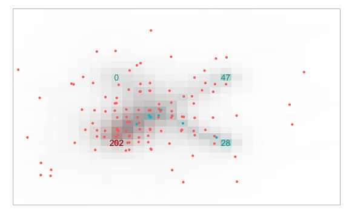

##   Introduction 

- The Ant Colony Simulation is an application written as an assignment for
Coursera's
[Developing Data Products](https://www.coursera.org/learn/data-products) class.
- The purpose of this application is to simulate behaviour of ants living on the flat
rectangular world divided into rectangular cells.
- The app is written in [R](https://www.r-project.org/) using
[Shiny](http://shiny.rstudio.com/) framework.
- The app is available online (https://hermitko.shinyapps.io/Ant_Simulation/).
- This presentation is done in [Slidify](http://slidify.org/).
- Source codes for the app and this presentation can be found on [github]
(https://github.com/hermitko/DataProducts_CourseProject).

---
##   Rules of simulation 

<style>
em {font-style:italic; color:#55f}
</style>

- The simulation runs in discrete time.
- Each second the state of the world is displayed.
- Ants are looking for food sources.
- When they found food, they try to bring it to the hive.
- In every _tick_ (time step), each ant move one step in one of eight
possible directions.
- Ants aren't communicating directly, they use _pheromones_ to mark their path
to food / to home.
- Exploring ants are likely to follow the path marked by
_food pheromones_.
- Ants that bring food back home follow the path marked by
_home pheromones_.

--- &twocol w1:48% w2:68%
##  Adjustable parameters 

The simulation has a lots of parameters, some of them can be adjusted in the app:

*** =left

- world parameters
  - the dimensions (`width` and `height`) 
  - `maximum ants at one place` 
- hive parameters
  - position (`the x-coord` and `the y-coord`)
  - `ants born each tick` 
  - `lifespan` of each ant
  - `hive pheromone rate` – how much home pheromones 
  release the hive itself)

*** =right

- food sources parameters
  - `count of food sources`
  - position (`n-th x` and `n-th y`) of particular food source
  - `n-th amount` –  the amount of food available in particular source
  

---

##  World visualisation example


```r
source("global.R")
world <- create_world(
    foods_data = data.frame(x = c(20L, 20L, 10L), y = c(20L, 10L, 20L),
        food_remaining = c(100L, 100L, 100L), pheromone_rate = c(1, 1, 1)))
world$tick(200L)
print(world$display())
```




